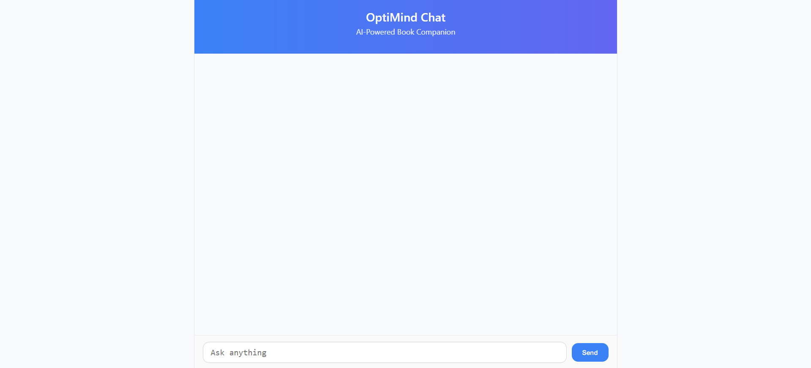
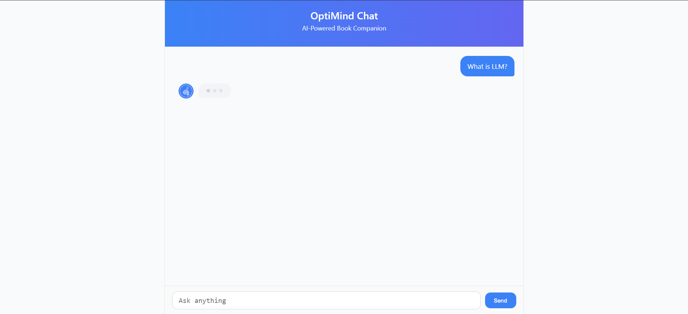
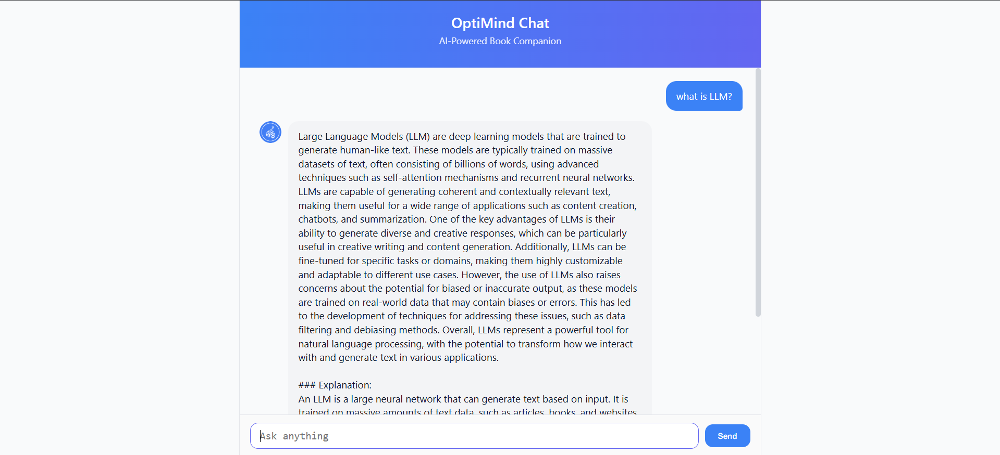
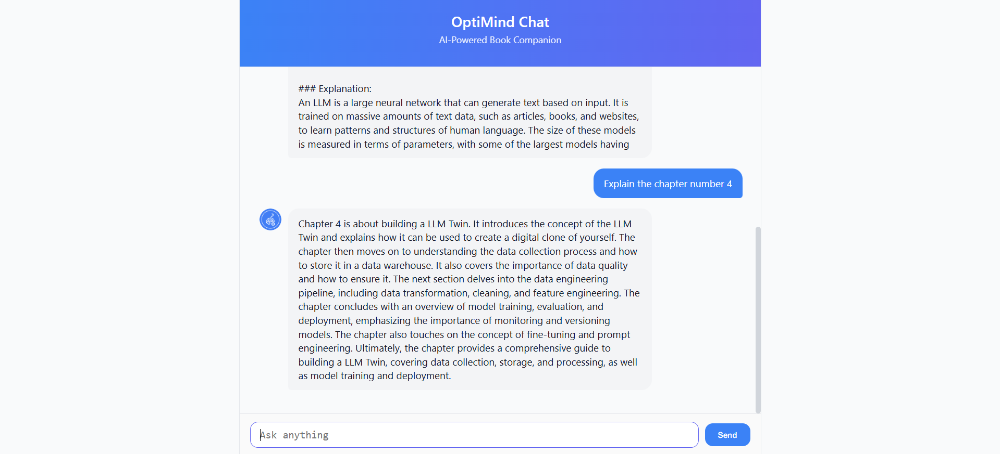

# **OptiMind_Chat**

## **Book Chatbot Project Using QLoRA and LLaMA-3.1-8B**

This project develops a domain-specific **Book Chatbot** by fine-tuning the **Meta-LLaMA-3.1-8B** model using the **QLoRA** technique on content extracted from *The LLM Engineers Handbook – Master the Art of Engineering Large Language Models* by Paul Iusztin and Maxime Labonne.
The system is deployed through a **FastAPI backend** and a **React frontend** for interactive conversational use.

---

### 📸 Project Images

   
   
   
  

### **Dataset Preparation**

The dataset was created from *The LLM Engineers Handbook*. Text was extracted using `pdfplumber`, cleaned to remove unnecessary formatting, and split into 1000-token segments. These were organized into training and validation sets to ensure balanced and efficient supervised fine-tuning.

### **Model Selection and Quantized Fine-Tuning (QLoRA)**

The base model **Meta-LLaMA-3.1-8B** was fine-tuned using **Quantized Low-Rank Adaptation (QLoRA)**.
This method used 4-bit quantization and low-rank adapters, training only small parameter subsets while keeping the main weights frozen.
The `trl` library’s Supervised Fine-Tuning (SFT) approach ensured efficient training with stable performance under limited GPU resources.

### **Merging the Trained Model**

After training, LoRA adapter weights were merged into the base model, producing a unified, self-contained checkpoint.
This final version required no external adapters and was optimized for fast inference.

### **Model Inference and Testing**

Inference testing used prompts related to book concepts, summaries, and moral insights.
The chatbot produced coherent, context-aware responses aligned with the book’s content and style, confirming successful fine-tuning.

### **Backend Development (FastAPI)**

The **FastAPI** backend served as the model’s interface through a `/generate` endpoint that processed prompts and returned generated text.
CORS middleware enabled frontend access, and Swagger UI documentation verified the API’s reliability and usability.

### **Frontend Development (React)**

The **React** frontend provided a clean, chat-based interface with user and bot message bubbles.
Typing animations, a favicon, and a bot avatar enhanced interaction and branding.
Axios handled API communication, ensuring real-time responses from the model.

---

  

  THANK YOU

